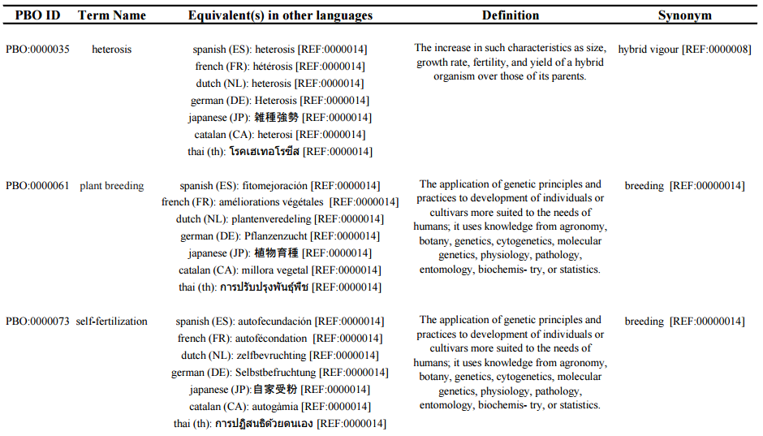

# Abstract

The need of standardizing the language used within a community has been recognized as one of the major components to enable a better integration of data as well as their further analysis. The plant breeding community makes use of a very specialized language, which has been evolving according to the new technologies and needs of their final users (e.g. farmers). That community is disparate all over the world. Therefore, a translation of the most common used terms has always been a key asset to accomplish their objectives as well as the ones of their collaborators. Here, we present PBO (Plant Breeding Ontology), an ontology for the plant breeding community which captures more than 2200 entries where 80 represent the core terms. PBO has translations in 8 different languages: English (main language), Spanish, French, Dutch, German, Japanese, Catalan and Thai, as well as their definitions, synonyms, derived terms and samples of their usage. PBO has been built partially manually and semiautomatically.

# Introduction

The exercise of standardizing the specialized vocabulary of a certain community is nowadays considered as an important component in any project, discussion, documentation, and so forth [@Bos1995]. Several initiatives, from the academic and industrial sectors, have proposed standards for exchanging data, sharing documentation, or to simply provide a common framework to ensure a better communication [@Shrestha2012]. The creation of specialized ontologies paves the way towards a uniform, standard terminology within a specialized community. The plant breeding community, as any other specialized community, has its own terminology which is not only used by the plant breeders themselves but an entire chain of people: growers, researchers, regulatory affairs officers, and so on [@Bruskiewich2008]. 

In spite of the existence of several glossaries, dictionaries, and in general terminological resources for the plant breeding community [@Schlegel2009, @Nagur, @Jain2006, @Choudhary2012], there are only a few resources which are first of all up-to-date, and that cover their terminology systematically, categorically and in various languages. Such a limitation prevents the common exchange channels to work in a more efficient manner. In this work, around 2200 terms were collected that are relevant for the plant breeding domain. Out of that collection of terms, we have chosen 80 core entries for which a definition (plus its source), synonyms (plus their source) and their equivalents in other 7 languages: Spanish, French, Dutch, German, Japanese, Catalan and Thai are provided for several entries. In this work, English has been taken as the driver language for its importance in technical and specialized situations: R&D communications, business communications, data exchange between academic/industry partners, and computational systems support.

Another important motivation for developing PBO further came from the BioHackathon 2023 and 2024 to support the data harmonization and standardization efforts through controlled vocabularies, taxonomies and ontologies in the Life Sciences and within the academic research community in that domain. The resulting ontology is expected to be a key component for the next steps towards such a standardization.

This document is organized as follows: an introductory section (this section), which spells out the motivation and reasons on embarking on improving PBO; a methods section, which details how the ontology was built; an outcomes section, which summarizes the product features; and finally, the future work section delineates the next steps for the follow up of the ontology.

# Methods

## a) Motivation and prospective users

The motivation for building an ontology about plant breeding is outlined in the introduction section; briefly, the need arises from better supporting the work of plant breeding actors:

  - seed growers,
  - plant breeders,
  - field testers,
  - wet-lab scientist,
  - dry-lab scientists (e.g. computational life scientists).

Although PBO is targeted to mainly support the activities of those prospective users, it could also be employed by other users or groups of people, for instance:

  - agronomists,
  - students (e.g. biology, biochemistry, terminology, computer sciences)
  - lawyers dealing with plant variety protection aspects,
  - regulatory affairs officers,
  - intellectual property counselors.

Given that the ontology is specialized, it might not be useful or informative for other groups of people (e.g., pediatrician). Nevertheless, it might still hold terms that to some extend are found in the intersection of some domains. For instance, a pediatrician who works on particular genetic diseases might find terms relevant to his/her domain (e.g. mutant). The vast majority of users of PBO is expected to belong to: 

  1. the group of specialists in the domain who are formalizing their knowledge, refreshing it, or simply catching up with not-know terms
  2. the people who is relatively new to the plant breeding domain who have to learn the language of their colleagues, collaborators, or others.

## b) Terms compilation and selection

The terminology of a specialized domain, such as plant breeing, is typically found in specialized literature (e.g., scientific articles) or specialized resources (e.g. databases). All terms considered in this work were collected from scientific publications within the plant breeding domain [@Bos1995, @Schlegel2009, @Nagur, @Jain2006, @Choudhary2012, @24330272]. The identification of candidate terms for the ontology was mainly driven by the authors' experience and exposure to the plant-breeding domain. The candidate terms cover diverse sub-domains within the plant-breeding field (e.g. breeding techniques, genetics). Currently, PBO currently captures 80 core entries, which were picked up based on the following criteria (in order or importance):

  - The term serves as a “hub concept”, i.e. connects several other related concepts.
  - The term is found in most introductory and advanced literature about plant breeding.
  - The term is relevant for our current activities.

The “dumping out” of terms has been manually done: going through selected sections of the available material, then highlighting the nouns, adjectives and adverbs relevant to the field and according to the criteria stated above, then adding them into a graph of concepts (see network of concepts in [Fig1]).

The compilation of the candidate terms produced several terms that were repeated (identical lexemes) and terms that were synonyms of other terms that had been already captured. In those cases, the terms were unified and only one representative was kept. During the compilation, several acronyms appeared often in the literature (e.g., SNP). The most frequent were considered in this work.

The selection of the 80 key terms ensures a balanced coverage of the various sub-domains represented in the resulting compilation. Some terms are very specialized to the domain (e.g., cultivar), while others are more generic (e.g., gene).

## c) Network of concepts (NoC)

During the “dumping out” process, each candidate term was systematically added to a network of concepts. That network not only captured the terms themselves but also the relationships amongst them. Therefore, related terms were connected through a relationships which could either be hierarchical (sub-type) or simply connectional (i.e., there is a relation between the two terms, which is not hierarchical). [Fig1] shows a part of the network of concepts (NoC).


The plant-breeding network of concepts should be read from the top to the down for having a better overview of each entry and its conceptual neighborhood. Concepts that are at the same level of importance or that are somehow comparable are shown at the same horizontal level. On the one hand, the dotted lines between two nodes denote that there is a non-hierarchical relation between them (e.g., is related to). On the other hand, the arrows connection two nodes denote a subtyping (hierarchical) relation. For the sake of readability, some nodes (shown in red) were duplicated. The length of each relationship has no meaning at all. However, the closer two entries that are connected to the same 3rd entry, the more related they are. 

The NoC was designed so that there are no isolated entries, that is, all of them are somehow connected. Such a connectivity strategy enables to “hop” from one entry to another one through related concepts.

Some nodes have more than 1 relationship connecting it to other terms; however, there are no nodes with more than one hierarchical link to a second generic node.

All the encircled nodes (80 in total) in the NoC are currently part of PBO. The rest (around 2000) provide not only a context for the encircled nodes but also complementary information. Fig2 depicts the entire network (due to its complexity and size, it is recommended to instead check the supplementary material to view the details thereof).


Organizing the concepts in a graph was essential to fulfill one of the aims of this work: categorize the entries in the ontology. 

## d) Finding a definition for each concept

Several resources (see Table 1) were used to gather the definitions corresponding to the entries in PBO. Most of the ontology term definitions were collected from online resources, with the exception of a few hard-copy resources.

All the 80 core terms have a definition and a reference, which links the entry to the source of the definition itself. None of the definitions was adapted (i.e. changed).

| Ref. Code | Source Name | Details |
| -------- | -------- | -------- |
| REF:0000001 | Random House Unabridged Dictionary | http://dictionary.infoplease.com/ |
| REF:0000002 | Wiktionary | http://en.wiktionary.org/ |
| REF:0000003 | Oxford Dictionaries | http://www.oxforddictionaries.com/ |
| REF:0000004 | American Heritage Dictionary of the English Language, 4th edition | http://americanheritage.yourdictionary.com |
| REF:0000005 | Collins English Dictionary | http://www.collinsdictionary.com/ |
| REF:0000006 | Dictionary of Plant Breeding, Second Edition Schlegel, Rolf H. J. | ISBN 978-1-4398-0242-7 |
| REF:0000007 | Cambridge Advanced Learner's Dictionary | http://dictionary.cambridge.org/ |
| REF:0000008 | Encyclopaedia Britannica Online | http://www.britannica.com/ |
| REF:0000009 | Merriam-Webster Online Dictionary | http://www.merriam-webster.com/ |
| REF:0000010 | Modern Biotechnology | Primrose S.B., Oxford, 1987 |
| REF:0000011 | Forest Genetics Glossary | Charles A. Maynard. State University of New York. College of Environmental Science and Forestry. http://www.esf.edu/for/maynard/GENE_GLOSSERY.html |
| REF:0000012 | Macmillan British English Dictionary | http://www.macmillandictionary.com/ |
| REF:0000013 | A Glossary for Crop Improvement | T. Nagur, D.L. Oswalt, and Faujdar Singh. International Crops Research Institute for the Semi-Arid Tropics. Patancheru, Andhra Pradesh 502 324, India |
| REF:0000014 | The IATE (InterActive Terminology for Europe) terminology database | http://iate.europa.eu/ |
| REF:0000015 | A Dictionary of Genetics (7 ed.) | Robert C. King, William D. Stansfield, and Pamela K. Mulligan. Oxford University Press. ISBN-13: 9780195307610 |
| REF:0000016 | Macmillan Dictionary of Genetics & Cell Biology | Maclean, Norman. London: Macmillan Reference Books, 1987 |
| REF:0000017 | Wikipedia | http://en.wikipedia.org/ |
| REF:0000018 | WordNet | https://wordnet.princeton.edu/ |
| REF:0000019 | GeneReviews | Pagon RA, Adam MP, Ardinger HH, et al., editors. Seattle (WA): University of Washington, Seattle; 1993-2015. |
| REF:0000020 | Convention on Biological Diversity | http://www.cbd.int/ |
| REF:0000021 | Intellectual Property. International Seed Federation. | http://www.worldseed.org/isf/intellectual_property.html |
| REF:0000022 | FAO TERM PORTAL | http://www.fao.org/faoterm/en/ |
| REF:0000023 | Biology-Online Dictionary | http://www.biology-online.org/dictionary/ |
| REF:0000024 | Glossary of Biotechnology for Food and Agriculture - A Revised and Augmented Edition of the Glossary of Biotechnology and Genetic Engineering | Food and Agriculture Organization of the United Nations. ISSN 1020-0541 |
| REF:0000025 | Dictionary of Forestry | http://dictionaryofforestry.org/ |
| REF:0000026 | The Encyclopedia of Seeds : Science, Technology and Uses | Bewley J, Black M, Halme P. ISBN-13: 9780851997230 (1st Ed) |
| REF:0000027 | The United Nations Terminology Database (UNTERM) | http://untermportal.un.org/portal/welcome |
| REF:0000028 | The International Service for the Acquisition of Agri-biotech Applications | https://www.isaaa.org/gmapprovaldatabase/default.asp |

Table 1: Sources of the definitions for the entries in PBO. The first column provides a unique code used in the glossary to link entry definitions to their source. The second column shows the name of the resource. The third column provides either the URL of the online resource or the book details. 

## e) Synonyms and derived terms

Systematic searches in dictionaries and online resources were manually performed in order to look up for synonyms as well as derived terms for a selected subset of PBO. It currently has synonyms for more than 30 entries and derivatives for 12 entries.

Each sentence has been carefully reviewed so that it belongs to the domain of interest: plant breeding. This material is available in the original excel file used to compile the core concepts.

## f) A manual compilation empowered by automatic retrieval 

All terms, their definitions, their synonyms an derived terms were manually collected. The network of concepts has also been manually built (terms plus relationships). During the entire process, various validations steps were included to ensure a high quality of the resulting product (see Fig3). Most of those validation steps were automatically done (computationally developed) to deal with aspects such a term duplication, consistency of identifiers, generation of reports based on the master data file, uniformity, ordering, formatting, etc.

Automatic tools (not yet publically available) were developed to support the compilation of the context samples and collocations. Also, those tools supported the automatic retrieval (from sources such as PubMed, WordNet, IATE, dict.org) of terms as well as the quality checks (such as consistency of the spelling).

Another motivation for automatizing some parts of the process came from the fact that this ontology is expected to continue growing. Therefore, even thought it has taken a lot of time to develop such automatized solutions, future improvements will be facilitated. On the one hand, a more advanced natural language processing could improve the glossary building process.

Relying only on automatic tools could be risky; thus, a manual curation component as part of the process should be still be part of the maintenance process.

![Workflow for Data Transformation and Integration into Public Ontology Databases. The process begins with manual curation of data, which is stored in an Excel file. A Python parser converts the Excel data into an OBO (Open Biological and Biomedical Ontology) format. A Ruby parser then converts the OBO file into an RDF (Resource Description Framework) file. The RDF file is uploaded to a SPARQL endpoint and integrated into public ontology databases such as BioPortal and AgroPortal, facilitating data accessibility and interoperability. \label{Fig3}](./workflow.pdf)

## g) Sample entries



## h) Sample queries

![Example of a SPARQL Query and Interface Using GraphDB. This figure illustrates the SPARQL query editor and results interface of a SPARQL endpoint within GraphDB. The displayed query retrieves RDF classes with their labels and alternative labels, filtering for languages "jp" (Japanese) or "fr" (French). The query results are shown in tabular form below, listing unique identifiers, labels, and alternative labels for terms. This serves as an example of how queries can be constructed and executed in GraphDB. Additional example queries can be found in the appendix. \label{Fig5}](./sample_queries.png)

# Results

1. More than 2200 records capture the entries currently held in PBO, where 80 represent the core records. All entries have an ID of the form: PBO:nnnnnnn, where nnnnnnn corresponds to a unique number. It is important to note that even though almost all entries are nouns, most of them can also be employed as adjectives with no modification (e.g. inbreeding, mutant). Moreover, some entries may also be used as verbs (e.g. to plant, to phenotype). A separate property captures the term translations in five languages (Spanish, French, Dutch, German, and Japanese) for each record. Each one of the selected 80 core records has a definition as well as a reference, which corresponds to the source from where the definition was taken (see Table 1). Some entries include synonyms as well as acronyms (which for the sake of simplicity are captured within the same group). Finally, each entry provides a sample context text, where the term (or an inflection thereof) is employed (see excel file).

2. An ontology, named PBO, holding around 2200 entries has been produced. This ontology aims at filling a gap in the plant breeding community in a way that the terminology could be findable, accessible, interoperable, and reusable (F.A.I.R). PBO is not intended to compete with ontologies from authoritative bodies or similar resources (e.g., Food and Agriculture Organization [@AGROVOC], Inter-Active Terminology for Europe [@IATE], Crop Ontology [@Shrestha2012], Agronomy Ontology [@Aubert2017]); on the contrary, it aims at complementing them by providing specially a categorical view of the terminology, which could be used in various languages and enable a better communication among the relevant actors within the plant breeding community. PBO is currently available in OBO and RDF formats - an excel dump is as well available on demand -- so that it could be easily reused, extended and shared. Building this ontology with the aid of specialized computational tools not only fostered the development of the terminological resources but also contributed to their quality and future enrichement.

# Future work

The resulting network of concepts amounts to more than 2000 entries. We expect to cover, in the near future, the entries that were not taken into account in this improvement phase and to come up with a sounder ontology. PBO will be made available in a public ontology repository (e.g., BioPortal), so that it could get improved by experts in the field as well as the rest of the communinity. The automatic tools that were implemented will be improved and ideally published as a complementary material to the ontology. 

## Acknowledgements

We would like to thank the fellow participants of the BioHackathon 2023 and 2024 for their collaboration and constructive advice, which greatly influenced our project. We are grateful to the funding bodies of the BioHackathon 2023 and 2024: Database Center for Life Science (DBCLS) and the Japan Science and Technology Agency (JST) Department of the NBDC Program. Special thanks to Nuria Queralt and Maria Gomez for the support developing the queries, translations to Catalan and the original pipeline development.

## References

## Appendix

Example query 1: retrieve the terms with a translation in japanese AND french

```
PREFIX rdf: <http://www.w3.org/1999/02/22-rdf-syntax-ns#>
PREFIX owl: <http://www.w3.org/2002/07/owl#>
PREFIX rdfs: <http://www.w3.org/2000/01/rdf-schema#>
PREFIX skos: <http://www.w3.org/2004/02/skos/core#>
select ?s ?label ?altlabel where { 
    ?s rdf:type owl:Class.
    ?s rdfs:label ?label .
    ?s skos:altLabel ?altlabel .
    FILTER (lang(?altlabel) = "jp" || lang(?altlabel)="fr")
} ORDER BY ?s 
```

Example query 2: retrieve the all the synonyms of a given term

```
PREFIX rdf: <http://www.w3.org/1999/02/22-rdf-syntax-ns#>
PREFIX owl: <http://www.w3.org/2002/07/owl#>
PREFIX rdfs: <http://www.w3.org/2000/01/rdf-schema#>
PREFIX skos: <http://www.w3.org/2004/02/skos/core#>
select ?altlabel where { 
    ?s rdf:type owl:Class.
    ?s rdfs:label ?label .
    FILTER (?label = "emasculation"@en)
    ?s skos:altLabel ?altlabel.
}
```

Example query 3: retrieve the list of terms related to ‘molecular marker’

```
PREFIX rdf: <http://www.w3.org/1999/02/22-rdf-syntax-ns#>
PREFIX owl: <http://www.w3.org/2002/07/owl#>
PREFIX rdfs: <http://www.w3.org/2000/01/rdf-schema#>
PREFIX sio: <http://semanticscience.org/resource/>
select ?relate_to_label where { 
    ?s rdf:type owl:Class.
    ?s rdfs:label ?label .
    FILTER (?label = "molecular marker"@en)
    ?s sio:SIO000001 ?related_to .
    ?related_to rdfs:label ?relate_to_label .
}
```

Example query 4: retrieve the “child” terms of the term “ploidy”

```
PREFIX rdf: <http://www.w3.org/1999/02/22-rdf-syntax-ns#>
PREFIX owl: <http://www.w3.org/2002/07/owl#>
PREFIX rdfs: <http://www.w3.org/2000/01/rdf-schema#>
PREFIX sio: <http://semanticscience.org/resource/>
select ?p ?plabel where { 
    ?s rdf:type owl:Class.
    ?s rdfs:label ?label .
    FILTER (?label = "ploidy"@en)
    ?p sio:SIO000001 ?s.
    ?p rdfs:label ?plabel.
}
```

Example query 5: retrieve the definition of ‘genotyping’

```
PREFIX rdf: <http://www.w3.org/1999/02/22-rdf-syntax-ns#>
PREFIX owl: <http://www.w3.org/2002/07/owl#>
PREFIX rdfs: <http://www.w3.org/2000/01/rdf-schema#>
PREFIX skos: <http://www.w3.org/2004/02/skos/core#>
select * where { 
	?s rdf:type owl:Class.
    ?s rdfs:label ?label .
    FILTER (?label = "genotyping"@en)
    ?s skos:definition ?def.
}
```
